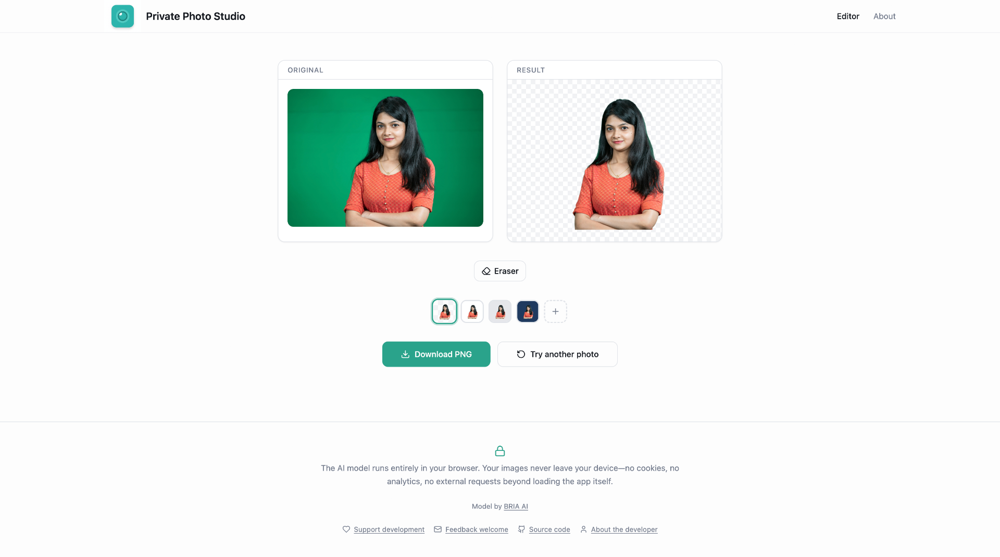
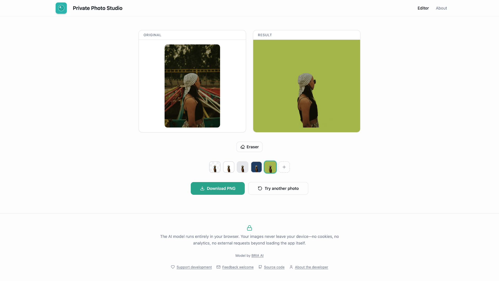
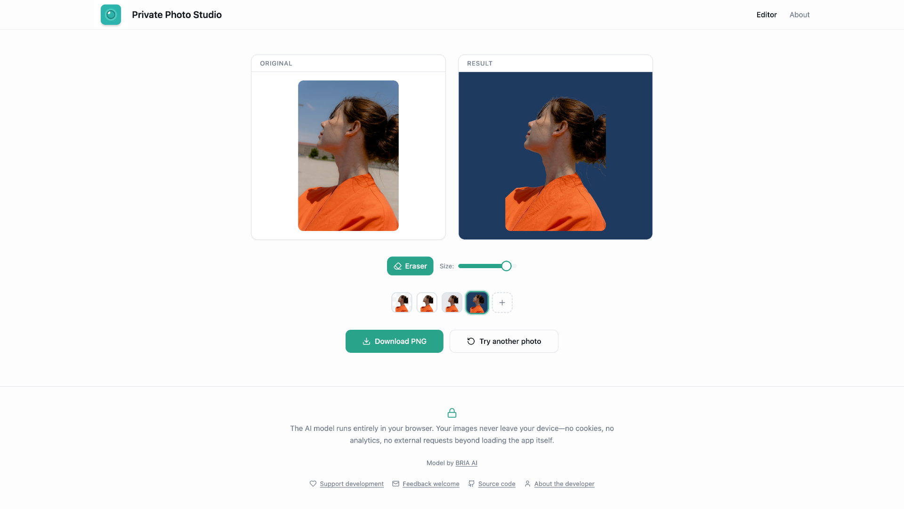

# pfppg — Private Photo Studio

Remove backgrounds from profile pictures. All processing happens in your browser — nothing is uploaded.

---

## Examples

  
  
  

Photo by <a href="https://unsplash.com/@anil_sharma_india?utm_source=unsplash&utm_medium=referral&utm_content=creditCopyText">Anil Sharma</a> on <a href="https://unsplash.com/photos/a-woman-standing-with-her-arms-crossed-in-front-of-a-green-background-S3iOXqVlh5s?utm_source=unsplash&utm_medium=referral&utm_content=creditCopyText">Unsplash</a>
· Photo by <a href="https://unsplash.com/@zulfugarkarimov?utm_source=unsplash&utm_medium=referral&utm_content=creditCopyText">Zulfugar Karimov</a> on <a href="https://unsplash.com/photos/woman-in-orange-shirt-looking-up-at-the-sky-o_8YqDTkCGw?utm_source=unsplash&utm_medium=referral&utm_content=creditCopyText">Unsplash</a>
· Photo by <a href="https://unsplash.com/@amirkiannii?utm_source=unsplash&utm_medium=referral&utm_content=creditCopyText">Amir Kiani</a> on <a href="https://unsplash.com/photos/a-woman-standing-in-front-of-a-carnival-ride-fB-eMMMjT8s?utm_source=unsplash&utm_medium=referral&utm_content=creditCopyText">Unsplash</a>

---

## Documentation

- [Verifying Privacy](docs/verifying-privacy.md) — How to confirm your photos never leave your device
- [Running Locally](docs/running-locally.md) — Prerequisites, install, dev server, build, tests
- [Technical Decisions](docs/technical-decisions.md) — WebGPU, canvas compositing, blob URLs, RMBG-1.4
- [Troubleshooting](docs/troubleshooting.md) — Slow loading, browser support, WASM fallback
- [Android Image Decode Retry](docs/android-image-decode-retry.md) — Retry logic for transient mobile failures

---

## Key Files

| File | Purpose |
|------|---------|
| `src/hooks/useBackgroundRemoval.ts` | Core logic: model loading, inference, canvas compositing |
| `src/pages/Index.tsx` | Main page orchestration and state management |
| `src/components/HeroSection.tsx` | Landing UI with privacy messaging and file picker |
| `src/components/PreviewSection.tsx` | Before/after preview cards and download button |
| `src/components/PrivacyFooter.tsx` | Privacy reassurance footer |
| `vite.config.ts` | Dev server and build configuration |

---

## Links & Support

**Model**

Background removal powered by [RMBG-1.4 by BRIA AI](https://huggingface.co/briaai).

**Disclaimer**

The model may not handle all pictures equally well—try different pictures and see what works best.

**Support & Contact**

- [Support development](https://liberapay.com/raoul/donate) — Help fund this and future tools
- [Feedback welcome](mailto:raoulcapello@proton.me) — Questions, suggestions, bug reports
- [Source code](https://github.com/raoulcapello/private-photo-studio/tree/main) — View and contribute on GitHub
- [More about me](https://www.raoulcapello.nl/) — Learn about the developer
